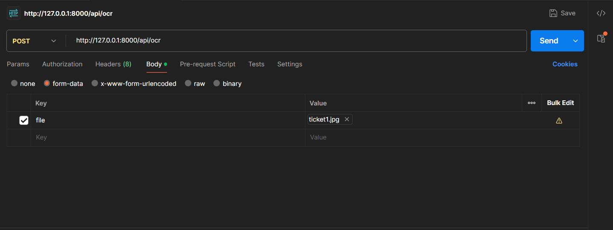

# clasificador_gastos

Proyecto: Clasificador Inteligente de Gastos desde Tickets
=========================================================

Este repositorio contiene código para tomar fotos o imágenes de tickets (boletas), extraer texto mediante OCR (Tesseract) y obtener datos estructurados: fecha, comercio y monto. También incluye heurísticas para mejorar el OCR en tickets reales y utilidades para depuración.
# clasificador_gastos

Proyecto: Clasificador Inteligente de Gastos desde Tickets
=========================================================

Este repositorio contiene código para tomar fotos o imágenes de tickets (boletas), extraer texto mediante OCR (Tesseract) y obtener datos estructurados: fecha, comercio y monto. También incluye heurísticas y herramientas de depuración.

Estructura del repositorio
# clasificador_gastos

Proyecto: Clasificador Inteligente de Gastos desde Tickets
=========================================================

Este repositorio contiene código para tomar fotos o imágenes de tickets (boletas), extraer texto mediante OCR (Tesseract) y obtener datos estructurados: fecha, comercio y monto. También incluye heurísticas y herramientas de depuración.

## Estructura del repositorio

- `data/` — imágenes de tickets de prueba. Ej.: `ticket1.jpg`, `ticket2.jpg`.
- `src/` — código principal (OCR, preprocesado, análisis, utilidades). Punto de entrada público: `src.ocr.extraer_texto(ruta)`.
- `tools/` — utilidades para debug y pruebas: `run_image.py`, `debug_image.py`, `dump_tokens.py`, `dump_all_tokens.py`, `inspect_monto_methods.py`.
- `tests/` — suite pytest con tests parametrizados.
- `results/` — (opcional) salida JSON guardada por `tools/run_image.py` si se habilita.
- `archive/` — copias de scripts y tests ticket-specific archivados.

## Requisitos básicos

1) Python 3.10+; usar virtualenv recomendado.

2) Instalar dependencias:

```powershell
python -m venv venv; & .\venv\Scripts\Activate.ps1; python -m pip install -r requirements.txt
```

3) Instalar Tesseract (binario) en Windows (ejemplo con Chocolatey):

```powershell
choco install -y tesseract
```

Comprobar instalación:

```powershell
where.exe tesseract; tesseract --version
```

## Cómo testear tickets (3 formas)

Aquí hay tres formas sencillas de ejecutar el extractor sobre una imagen y obtener la salida JSON.

- Método A — Usar la variable de entorno `TEST_IMAGE` con el test runner (recomendado para pruebas rápidas):

	```powershell
	$env:TEST_IMAGE = 'ticket2.jpg'   # nombre relativo dentro de data/ o ruta absoluta
	& "venv\Scripts\python.exe" -m pytest tests/test_run_image.py -q
	```

	Esto ejecuta el test que carga `TEST_IMAGE` y ejecuta `extraer_texto`, imprimiendo el JSON resultante.

- Método B — Editar `IMAGE_PATH` en `tools/run_image.py` (útil para debugging interactivo):

	1. Abrí `tools/run_image.py` y modificá la constante `IMAGE_PATH` al inicio del archivo para apuntar a la imagen deseada.
	2. Ejecutá:

	```powershell
	& "venv\Scripts\python.exe" tools\run_image.py
	```

	El script imprimirá la salida JSON en stdout. Por defecto `raw_data` se suprime para legibilidad; podés activar `raw_data` si necesitás más detalles.

- Método C — One-liner Python (rápido, sin editar archivos):

	```powershell
	& "venv\Scripts\python.exe" -c "from src.ocr import extraer_texto; import json; r=extraer_texto('./data/ticket2.jpg'); print(json.dumps(r, ensure_ascii=False, indent=2))"
	```

## Cómo ejecutar la suite de tests

- Ejecutar toda la suite:

```powershell
& "venv\Scripts\python.exe" -m pytest -q
```

- Ejecutar un test específico que usa `TEST_IMAGE` si está definida:

```powershell
& "venv\Scripts\python.exe" -m pytest tests/test_run_image.py -q
```

## Flujo del proyecto (qué hace cada carpeta)

- `data/` — Imágenes de ejemplo y datos de prueba. Pon aquí tus fotos para ejecutarlas con las herramientas.
- `src/` — Implementación del pipeline OCR:
	- `src/ocr.py` — Orquestador público; devuelve JSON con `id_imagen`, `text_raw`, `mean_confidence` y `fields` (monto/fecha) incluyendo `raw`, `normalized`, `value` y `confidence`.
	- `src/procesamiento.py` — Preprocesado de imagen y wrappers de Tesseract (incluye multi-scale y ROI second-pass).
	- `src/analisis.py` — Heurísticas para extraer monto y fecha (por boxes, líneas, tokens cercanos, ROI 'TOTAL').
	- `src/utils.py` — Normalizaciones (`normalize_monto`, `normalize_date`) y utilidades.
- `tools/` — Scripts de apoyo para debugging y desarrollo: runners, dumpers de tokens y comparadores de heurísticas.
- `tests/` — Tests automatizados (pytest). Los tests son parametrizables para poder ejecutar sobre cualquier imagen.
- `results/` — Carpeta opcional donde `tools/run_image.py` puede guardar JSON de salida para trazabilidad.
- `archive/` — Copias de scripts y tests ticket-specific que se retiraron del flujo principal.

## Debugging y utilidades

- `tools/dump_tokens.py` / `tools/dump_all_tokens.py`: listan tokens, coordenadas y confianzas (útil para inspeccionar output de Tesseract).
- `tools/debug_image.py`: reconstruye líneas y muestra tokens cercanos a la palabra 'TOTAL' y números detectados.
- `tools/inspect_monto_methods.py`: compara las distintas heurísticas de extracción y ayuda a entender cuál ganó.

## Salida JSON esperada

La función `extraer_texto(ruta)` devuelve un dict con al menos:

- `id_imagen` — nombre/ID de la imagen.
- `text_raw` — texto crudo concatenado extraído por OCR.
- `mean_confidence` — confianza media general (0-100).
- `fields` — diccionario con campos esperados, por ejemplo `monto` y `fecha`. Cada campo incluye:
	- `raw` — texto tal como lo devolvió la heurística.
	- `normalized` — valor normalizado (ej.: monto en formato decimal con punto).
	- `value` — número (float) cuando aplica.
	- `confidence` — confianza asociada (0..1).

Ejemplo breve (impreso por los tools):

```json
{
	"id_imagen": "ticket2.jpg",
	"mean_confidence": 74.9,
	"fields": {
		"monto": { "raw": "59,95", "normalized": "59.95", "value": 59.95, "confidence": 0.78 },
		"fecha": { "raw": "23/09/2025", "normalized": "2025-09-23", "confidence": 0.91 }
	}
}
```
COMO PRENDER EL BACK?  python -m uvicorn backend.main:app --reload --host 127.0.0.1 --port 8000


## Próximos pasos sugeridos

1) Afinar ROI second-pass y multi-scale ensemble cuando la confianza sea baja.
2) Recolectar un pequeño dataset etiquetado (ground-truth) y añadir tests de regresión que verifiquen valores normalizados.
3) Integrar una pequeña UI (Streamlit) para validar manualmente y guardar JSON en `results/`.

Si querés, puedo:

- Añadir un ejemplo en `tools/run_image.py` que guarde JSON en `results/` automáticamente.
- Ejecutar ahora el ROI second-pass sobre `ticket2.jpg` y mostrar el JSON antes/después para 
- 